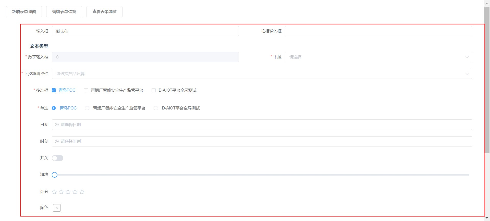
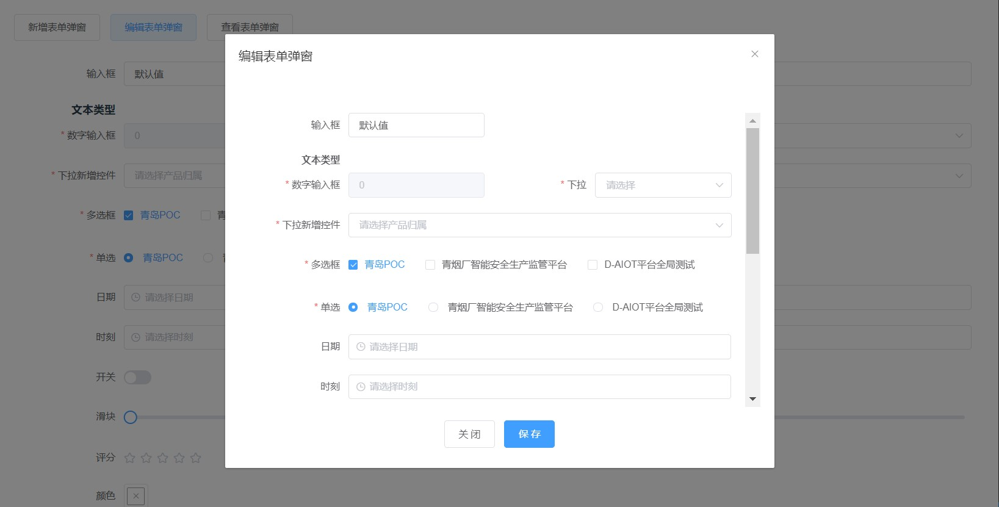

# ElFormChen、ElFormDialogChen

> 表单配置化组件、表单弹窗配置化组件可轻松生成表单，告别复制粘贴的噩梦，支持 el-input/el-input-number/el-checkbox/el-radio/el-select/el-date-picker/el-time-picker/el-switch/el-slider/el-rate/el-color-picker/el-upload

## 安装

- 1. 由于组件依赖 element-ui,所以项目需要引入[element-ui](https://element.eleme.cn/#/zh-CN/component/quickstart)

- 2.  安装 ElFormDialogChen
      ```shell
      npm i el-form-dialog-chen -S
      ```

## 注册

```javascript
import ElFormDialogChen from "el-form-dialog-chen";
Vue.use(ElFormDialogChen);
```

## 效果图

<p align="center">

</p>
<p align="center">

</p>

## 使用示例

```javascript
<template>
  <div id="app">
    <el-button @click="open('add', '新增表单弹窗')">新增表单弹窗</el-button>
    <el-button @click="open('edit', '编辑表单弹窗')">编辑表单弹窗</el-button>
    <el-button @click="open('view', '编辑表单弹窗')">查看表单弹窗</el-button>
    <!-- 表单弹框 -->
    <ElFormDialogChen
      ref="formDialog"
      v-bind="dialog"
      @closedialog="dialog.visible = false"
      @onsubmit="dialog.onsubmit"
    >
      <template #slotTest="{ $data, $props, config }">
        <el-form-item label="插槽输入框" prop="slotTest">
          <el-input
            v-model="$data.form.slotTest"
            :disabled="$props.type === 'view' || config.disabled"
          />
        </el-form-item>
      </template>
    </ElFormDialogChen>
    <!-- 可配置表单 -->
    <ElFormChen
      v-bind="form"
      @onsubmit="form.onsubmit"
      style="padding-bottom: 40px"
    >
      <template #slotTest="{ $data, $props, config }">
        <el-form-item label="插槽输入框" prop="slotTest">
          <el-input
            v-model="$data.form.slotTest"
            :disabled="$props.type === 'view' || config.disabled"
          />
        </el-form-item>
      </template>
    </ElFormChen>
  </div>
</template>

<script>
export default {
  name: "App",
  data() {
    return {
      defaultFormConfig: [
        // type支持input、slot、text、number、select、checkbox、radio、year、month、date、dates、week、datetime、datetimerange、daterange、monthrange、time、switch、slider、rate、color、textarea
        {
          type: "input", // 控件类型 input/select
          key: "name", // v-model绑定的键名
          label: "输入框", // 控件名称
          required: false, // 是否必须
          span: 12, // 控件整体占用宽度（同col）
          placeholder: "请输入",
          defaultValue: "默认值", // 默认值
          style: "width: 100%", // 控件样式
          elColStyle: "",
          addAttrs: ["slotTest"],
          validator: this.validator,
          events: {
            // 事件同el-input事件 https://element.eleme.cn/#/zh-CN/component/input#input-events
            blur: this.handle,
            focus: this.handle,
            change: this.handle,
            input: this.handle,
            clear: this.handle,
          },
        },
        {
          type: "slot", // 插槽类型
          slotName: "slotTest", //插槽名字
          span: 12, // 控件整体占用宽度（同col）
        },
        {
          type: "text", // 文本类型
          label: "文本类型", //文字
          span: 24,
          style: "font-weight: bold",
        },
        {
          type: "number", // 控件类型 input/select
          key: "code", // 键名
          label: "数字输入框", // 控件名称
          required: true, // 是否必须
          span: 12, // 控件整体占用宽度（同col）
          controls: false,
          placeholder: "请输入",
          defaultValue: "", // 默认值
          disabled: true,
          style: "width: 100%", // 控件样式
          events: {
            // 事件同el-input事件 https://element.eleme.cn/#/zh-CN/component/input#input-events
            blur: this.handle,
            focus: this.handle,
            change: this.handle,
            input: this.handle,
            clear: this.handle,
          },
        },
        {
          type: "select",
          key: "projectId",
          label: "下拉",
          required: true,
          span: 12,
          placeholder: "请选择",
          style: "width: 100%",
          optionLabelKey: "label",
          optionValueKey: "value",
          options: [
            {
              label: "青岛POC",
              value: 1,
            },
            {
              label: "青烟厂智能安全生产监管平台",
              value: 2,
            },
            {
              label: "D-AIOT平台全局测试",
              value: 3,
            },
          ],
          events: {
            // 事件同el-select事件https://element.eleme.cn/#/zh-CN/component/select#select-events
            change: this.handle,
            "visible-change": this.handle,
            "remove-tag": this.handle,
            blur: this.handle,
            focus: this.handle,
            clear: this.handle,
          },
        },
        {
          type: "select",
          key: "productId",
          label: "下拉新增控件",
          required: true,
          span: 24,
          placeholder: "请选择产品归属",
          style: "width: 100%",
          optionLabelKey: "name",
          optionValueKey: "id",
          options: [
            {
              id: 1,
              name: "电机-非直连",
            },
            {
              id: 2,
              name: "ONVIF摄像头",
            },
            {
              id: 3,
              name: "大数据关联产品",
            },
          ],
          addFormConfig: [
            {
              type: "select",
              key: "parentId",
              label: "新增的控件",
              required: true,
              span: 24,
              placeholder: "请选择",
              style: "width: 100%",
              optionLabelKey: "label",
              optionValueKey: "value",
              options: [
                {
                  label: "测试",
                  value: 1,
                },
              ],
            },
          ],
          events: {
            change: this.handleProduct,
          },
        },
        {
          type: "checkbox",
          key: "checkbox",
          label: "多选框",
          required: true,
          span: 24,
          placeholder: "请选择",
          style: "width: 100%",
          optionLabelKey: "label",
          optionValueKey: "value",
          defaultValue: [1],
          options: [
            {
              label: "青岛POC",
              value: 1,
            },
            {
              label: "青烟厂智能安全生产监管平台",
              value: 2,
            },
            {
              label: "D-AIOT平台全局测试",
              value: 3,
            },
          ],
        },
        {
          type: "radio",
          key: "radio",
          label: "单选",
          required: true,
          span: 24,
          placeholder: "请选择项目归属",
          style: "width: 100%",
          optionLabelKey: "label",
          optionValueKey: "value",
          defaultValue: 1,
          options: [
            {
              label: "青岛POC",
              value: 1,
            },
            {
              label: "青烟厂智能安全生产监管平台",
              value: 2,
            },
            {
              label: "D-AIOT平台全局测试",
              value: 3,
            },
          ],
          events: {
            // 事件同el-select事件https://element.eleme.cn/#/zh-CN/component/select#select-events
            change: this.handle,
            "visible-change": this.handle,
            "remove-tag": this.handle,
            blur: this.handle,
            focus: this.handle,
            clear: this.handle,
          },
        },
        {
          type: "datetime",
          key: "date",
          label: "日期",
          span: 24,
          rows: 4,
          maxlength: 200,
          disabled: false,
          placeholder: "请选择日期",
          style: "width: 100%",
        },
        {
          type: "time",
          key: "time",
          label: "时刻",
          span: 24,
          rows: 4,
          maxlength: 200,
          disabled: false,
          placeholder: "请选择时刻",
          style: "width: 100%",
        },
        {
          type: "switch",
          key: "switch",
          label: "开关",
          span: 24,
          rows: 4,
          maxlength: 200,
          required: false,
          disabled: false,
          placeholder: "请选择",
          style: "width: 100%",
        },
        {
          type: "slider",
          key: "slider",
          label: "滑块",
          span: 24,
          rows: 4,
          maxlength: 200,
          disabled: false,
          placeholder: "请选择",
        },
        {
          type: "rate",
          key: "rate",
          label: "评分",
          span: 24,
          rows: 4,
          maxlength: 200,
          disabled: false,
          placeholder: "请选择",
        },
        {
          type: "color",
          key: "color",
          label: "颜色",
          span: 24,
          rows: 4,
          maxlength: 200,
          disabled: false,
          placeholder: "请选择",
        },
        {
          type: "file",
          key: "file",
          label: "文件",
          span: 24,
          rows: 4,
          fileList: [
            {
              name: "food.jpeg",
              url: "https://fuss10.elemecdn.com/3/63/4e7f3a15429bfda99bce42a18cdd1jpeg.jpeg?imageMogr2/thumbnail/360x360/format/webp/quality/100",
            },
            {
              name: "food2.jpeg",
              url: "https://fuss10.elemecdn.com/3/63/4e7f3a15429bfda99bce42a18cdd1jpeg.jpeg?imageMogr2/thumbnail/360x360/format/webp/quality/100",
            },
          ],
          showFileList: false,
          listType: "text",
          disabled: false,
          placeholder: "只能上传jpg/png文件，且不超过500kb",
        },
        {
          type: "textarea",
          key: "describe",
          label: "描述",
          span: 24,
          rows: 4,
          maxlength: 200,
          disabled: false,
          placeholder: "请输入描述",
          style: "width: 100%",
        },
      ],
      dialog: {
        visible: false,
        isLoading: false,
        type: "edit",
        title: "表单模态框",
        labelPosition: "right",
        formConfig: [],
        formData: {},
        addAttrs: [],
        onsubmit: this.onsubmit,
        size: "medium",
        submitLoading: true,
        dialog: true,
      },
      form: {},
    };
  },
  created() {
    this.dialog.formConfig = [...this.defaultFormConfig];
    this.form = { ...this.dialog };
    this.form.dialog = false;
  },
  methods: {
    open(handelType, title) {
      this.dialog.type = handelType;
      this.dialog.title = title;
      this.dialog.formConfig = [...this.defaultFormConfig];
      this.dialog.formData = {};
      this.dialog.visible = true;
    },
    // val: 值, config：配置, index：序号, treatedFormConfig：生成好的表单配置列表, formData：表单数据, srcFormData： 表单原始数据
    handle(val, config, index, treatedFormConfig, formData, srcFormData) {},
    // 动态新增/减少控件
    handleProduct(
      val,
      config,
      index,
      treatedFormConfig,
      formData,
      srcFormData
    ) {
      let formConfig = [...this.defaultFormConfig];
      formConfig.splice(index + 1, 0, ...(config.addFormConfig || []));

      this.dialog.formConfig = formConfig;
      this.dialog.formData = formData;
    },
    // 自定义表单校验规则
    validator(rule, value, callback) {
      if (!value) {
        callback(new Error("不能为空"));
      } else {
        callback();
      }
    },
    // handelType 弹窗操作类型, formData 表单数据, srcFormData 原始表单数据, closeCb 关闭弹窗函数
    onsubmit(handelType, formData, srcFormData, closeCb, hideLoading) {
      new Promise((resolve, reject) => {
        setTimeout(closeCb, 1000);
      });
    },
  },
};
</script>

<style>
#app {
  font-family: "Avenir", Helvetica, Arial, sans-serif;
  -webkit-font-smoothing: antialiased;
  -moz-osx-font-smoothing: grayscale;
  color: #2c3e50;
  position: absolute;
  top: 20px;
  right: 20px;
  bottom: 20px;
  left: 20px;
}
</style>
```

## ElFormChen 源码

```javascript
<template>
  <div>
    <div class="formdialog" v-loading="isLoading">
      <el-form
        :model="form"
        :rules="rules"
        :labelWidth="labelWidth"
        :label-position="labelPosition"
        :size="size"
        :style="{
          maxHeight: dialog
            ? 'calc(100vh - 310px)'
            : '10000000000px !important',
        }"
        ref="form"
      >
        <el-row :gutter="20">
          <el-col
            v-for="(config, index) in treatedFormConfig.filter(
              (config) => !config.hidden
            )"
            :key="config.key"
            :span="config.span"
            :style="config.elColStyle || ''"
          >
            <slot
              v-if="config.type === 'slot'"
              :name="config.slotName"
              :$props="$props"
              :$data="$data"
              :config="config"
            />
            <div
              v-else-if="config.type === 'text'"
              class="dflex mgb10"
              style="text-align: right"
              :style="config.style"
            >
              <div
                :style="{ width: labelWidth }"
                style="padding-right: 12px; box-sizing: border-box"
              >
                <span class="mgr10">{{ config.label }}</span>
              </div>
              <div class="flex"></div>
            </div>

            <el-form-item v-else :label="`${config.label}`" :prop="config.key">
              <!-- 输入框 -->
              <el-input
                v-if="config.type === 'input'"
                v-model="form[config.key]"
                v-bind="config"
                :disabled="type === 'view' || config.disabled"
                v-on="eventsAddParams(config.events, config, index)"
              />
              <!-- 数字 -->
              <el-input-number
                v-if="config.type === 'number'"
                v-model="form[config.key]"
                v-bind="config"
                :disabled="type === 'view' || config.disabled"
                v-on="eventsAddParams(config.events, config, index)"
              />
              <!-- 文本域 -->
              <el-input
                v-if="config.type === 'textarea'"
                v-model="form[config.key]"
                v-bind="config"
                :disabled="type === 'view' || config.disabled"
                v-on="eventsAddParams(config.events, config, index)"
              >
              </el-input>
              <!-- 多选 -->
              <el-checkbox-group
                v-if="config.type === 'checkbox'"
                v-model="form[config.key]"
                v-bind="config"
                :disabled="type === 'view' || config.disabled"
                v-on="eventsAddParams(config.events, config, index)"
              >
                <el-checkbox
                  v-for="item in config.options"
                  :key="
                    config.optionValueKey
                      ? item[config.optionValueKey]
                      : item.value
                  "
                  :label="
                    config.optionValueKey
                      ? item[config.optionValueKey]
                      : item.value
                  "
                >
                  {{
                    config.optionLabelKey
                      ? item[config.optionLabelKey]
                      : item.label
                  }}
                </el-checkbox>
              </el-checkbox-group>
              <!-- 单选 -->
              <el-radio-group
                v-if="config.type === 'radio'"
                v-model="form[config.key]"
                v-bind="config"
                :disabled="type === 'view' || config.disabled"
                v-on="eventsAddParams(config.events, config, index)"
              >
                <el-radio
                  v-for="item in config.options"
                  :key="
                    config.optionValueKey
                      ? item[config.optionValueKey]
                      : item.value
                  "
                  :label="
                    config.optionValueKey
                      ? item[config.optionValueKey]
                      : item.value
                  "
                >
                  {{
                    config.optionLabelKey
                      ? item[config.optionLabelKey]
                      : item.label
                  }}
                </el-radio>
              </el-radio-group>
              <!-- 下拉 -->
              <el-select
                v-if="config.type === 'select'"
                v-model="form[config.key]"
                v-bind="config"
                :disabled="type === 'view' || config.disabled"
                v-on="eventsAddParams(config.events, config, index)"
              >
                <el-option
                  v-for="item in config.options"
                  :key="
                    config.optionValueKey
                      ? item[config.optionValueKey]
                      : item.value
                  "
                  :label="
                    config.optionLabelKey
                      ? item[config.optionLabelKey]
                      : item.label
                  "
                  :value="
                    config.optionValueKey
                      ? item[config.optionValueKey]
                      : item.value
                  "
                />
              </el-select>
              <!-- 日期 -->
              <el-date-picker
                v-if="
                  [
                    'year',
                    'month',
                    'date',
                    'dates',
                    'week',
                    'datetime',
                    'datetimerange',
                    'daterange',
                    'monthrange',
                  ].includes(config.type)
                "
                :type="config.type"
                v-model="form[config.key]"
                v-bind="config"
                :disabled="type === 'view' || config.disabled"
                v-on="eventsAddParams(config.events, config, index)"
              >
              </el-date-picker>
              <!-- 时间 -->
              <el-time-picker
                v-if="config.type == 'time'"
                :type="config.type"
                v-model="form[config.key]"
                v-bind="config"
                :disabled="type === 'view' || config.disabled"
                v-on="eventsAddParams(config.events, config, index)"
              >
              </el-time-picker>
              <!-- 开关 -->
              <el-switch
                v-if="config.type === 'switch'"
                type="date"
                v-model="form[config.key]"
                v-bind="config"
                :disabled="type === 'view' || config.disabled"
                v-on="eventsAddParams(config.events, config, index)"
              >
              </el-switch>
              <!-- 滑块 -->
              <el-slider
                v-if="config.type === 'slider'"
                v-model="form[config.key]"
                v-bind="config"
                :disabled="type === 'view' || config.disabled"
                v-on="eventsAddParams(config.events, config, index)"
              >
              </el-slider>
              <!-- 评分 -->
              <el-rate
                v-if="config.type === 'rate'"
                v-model="form[config.key]"
                v-bind="config"
                :disabled="type === 'view' || config.disabled"
                v-on="eventsAddParams(config.events, config, index)"
              ></el-rate>
              <!-- 颜色 -->
              <el-color-picker
                v-if="config.type === 'color'"
                v-model="form[config.key]"
                v-bind="config"
                :disabled="type === 'view' || config.disabled"
                v-on="eventsAddParams(config.events, config, index)"
              ></el-color-picker>
              <!-- 文件上传 -->
              <el-upload
                v-if="config.type === 'file'"
                v-model="form[config.key]"
                v-bind="config"
                :action="config.action || ''"
                :disabled="type === 'view' || config.disabled"
                v-on="eventsAddParams(config.events, config, index)"
              >
                <el-button
                  v-if="config['listType'] != 'picture-card'"
                  type="primary"
                  :size="size"
                  :disabled="type === 'view' || config.disabled"
                  >点击上传</el-button
                >
                <div
                  slot="tip"
                  class="el-upload__tip"
                  v-if="config.placeholder"
                >
                  <div v-html="config.placeholder" class="disabled"></div>
                </div>
              </el-upload>
            </el-form-item>
          </el-col>
        </el-row>
      </el-form>
      <div class="text-center mgt20">
        <el-button @click="closedialog">关 闭</el-button>
        <el-button v-if="type !== 'view'" type="primary" @click="onsubmit"
          >保 存</el-button
        >
        <slot name="addBtns" :$data="{ ...$data }" />
      </div>
      <slot name="tip" />
    </div>
  </div>
</template>

<script>
export default {
  name: "ElFormChen",
  data() {
    return {
      isLoading: false,
      form: {},
      rules: {},
      treatedFormConfig: [],
      saveFormConfig: [],
      saveRules: {},
      saveForm: {},
    };
  },
  props: {
    dialog: {
      // 是否是弹窗的表单
      type: Boolean,
      default: false,
    },
    type: {
      // 类型
      type: String,
      default: "add", // add or edit or view
    },
    labelPosition: {
      // 标签的位置 right/left/top
      type: String,
      default: "right",
    },
    labelWidth: {
      // 标签宽度
      type: String,
      default: "140px",
    },
    formConfig: {
      // 表单配置
      type: Array,
      default: () => [],
    },
    formData: {
      // 表单数据
      type: Object,
      default: () => {},
    },
    size: {
      // 表达尺寸 medium/small/mini
      type: String,
      default: "",
    },
    submitLoading: {
      // 提交是否显示loading状态
      type: Boolean,
      default: true,
    },
  },
  watch: {
    formConfig: {
      handler() {
        this.init();
      },
      immediate: true,
    },
  },
  methods: {
    init() {
      let form = {};
      let rules = {};
      this.form = {};
      this.rules = {};
      this.treatedFormConfig = [];

      this.saveFormConfig = [];
      this.saveRules = {};
      this.saveForm = {};

      let _this = this;
      this.treatedFormConfig = [...this.formConfig];
      this.treatedFormConfig.forEach((config, index) => {
        if (config.type === "text" || config.type === "slot") return;
        form[config.key] =
          this.formData[config.key] || this.formData[config.key] == 0
            ? this.formData[config.key]
            : config.defaultValue || config.defaultValue == undefined
            ? config.defaultValue
            : "";
        // 如果有追加参数
        if (config.addKeys && config.addKeys.length) {
          config.addKeys.forEach((key) => {
            form[key] = this.formData[key] || "";
          });
        }
        // 如果是必填，则生成规则
        let rule = {
          required: !!config.required,
        };
        if (config.validator) {
          rule.validator = config.validator;
        } else {
          rule.message = config.errorMsg || config.placeholder;
        }
        rules[config.key] = rule;

        // 如果是日期，并且有配置日期选择限制
        if (
          config.type === "date" &&
          config.disabledDateFormKey &&
          config.operator
        ) {
          config.pickerOptions = {
            disabledDate(time) {
              if (_this.form[config.disabledDateFormKey]) {
                let date = new Date(_this.form[config.disabledDateFormKey]);
                let val =
                  config.operator === ">"
                    ? time.getTime() > date.getTime()
                    : time.getTime() < date.getTime();
                return date ? val : false;
              }
              return false;
            },
          };
        }
      });
      this.form = form;

      this.rules = rules;
      this.reset();
      // 保存formConfig,rules,form
      this.saveFormConfig = [...this.formConfig];
      this.saveRules = {
        ...this.rules,
      };
      this.saveForm = {
        ...form,
      };
    },
    // 给事件回调函数添加参数
    eventsAddParams(events, config, index) {
      let rEvents = {};

      for (const key in events) {
        rEvents[key] = () => {
          events[key](
            this.form[config.key],
            config,
            index,
            this.treatedFormConfig,
            this.form,
            this.formData
          );
        };
      }
      return rEvents;
    },
    onsubmit() {
      this.$refs.form.validate((valid) => {
        if (valid) {
          let data = {
            ...this.form,
          };

          if (this.submitLoading) {
            this.isLoading = true;
            this.$emit(
              "onsubmit",
              this.type,
              data,
              this.formData,
              this.closedialog,
              this.hideLoading
            );
          } else {
            this.closedialog();
          }
        } else {
          console.log("error submit!!");
          return false;
        }
      });
    },
    showLoading() {
      this.isLoading = true;
    },
    hideLoading() {
      this.isLoading = false;
    },
    closedialog() {
      this.hideLoading();
      this.$emit("closedialog");
      return false;
    },
    reset() {
      this.$nextTick(() => {
        this.$refs.form && this.$refs.form.clearValidate();
      });
    },
  },
};
</script>
<style lang="less" scoped>
.dflex {
  display: flex;
}
.flex {
  flex: 1;
}
.text-center {
  text-align: center;
}
.text-left {
  text-align: left;
}
.mgb10 {
  margin-bottom: 10px;
}
.mgt20 {
  margin-top: 20px;
}
.disabled {
  color: #c0c4cc !important;
  cursor: not-allowed;
}
/deep/ .el-dialog__body {
  padding: 0px 0px 20px 0px;
}
/deep/ .el-form-item__label {
  height: 34px;
}

/deep/ .el-input-number input {
  text-align: left;
}

/deep/ .el-slider {
  padding: 0 10px;
}

/deep/ .el-rate {
  position: relative;
  top: 10px;
}

/deep/ .el-form-item--mini {
  .el-slider {
    position: relative;
    top: -7px;
  }
  .el-rate {
    position: relative;
    top: 5px;
  }
}

/deep/ .el-form-item--small {
  .el-slider {
    position: relative;
    top: -5px;
  }
  .el-rate {
    position: relative;
    top: 5px;
  }
}

.formdialog {
  margin-top: 30px;
}

.el-form {
  padding: 0px 20px;
  margin: 10px 0;
  min-height: 100px;
  overflow-y: auto;
}

.dsc {
  height: 45px;
  background: #f7f9fc;
  padding-left: 10px;
  line-height: 45px;
  // font-size: 0.72917vw;
  color: rgb(51, 119, 255);
  i {
    color: rgb(51, 119, 255);
  }
}
</style>

```

## ElFormDialogChen 源码

```javascript
<template>
  <div>
    <el-dialog
      top="50px"
      modal-append-to-body
      :title="title || '模态框'"
      :visible="visible"
      :width="width || '800px'"
      :destroyOnClose="destroyOnClose"
      :closeOnClickModal="closeOnClickModal"
      @close="$listeners.closedialog"
    >
      <ElFormChen v-bind="$attrs" v-on="$listeners" />
    </el-dialog>
  </div>
</template>

<script>
export default {
  name: "ElFormDialogChen",
  props: {
    visible: {
      // 显示/隐藏
      type: Boolean,
      default: false,
    },
    title: {
      // 标题
      type: String,
      default: "",
    },
    width: {
      // 宽度
      type: String,
      default: "",
    },
    destroyOnClose: {
      type: Boolean,
      default: true,
    },
    closeOnClickModal: {
      // 点击遮罩是否关闭弹窗
      type: Boolean,
      default: false,
    },
  },
};
</script>
```
